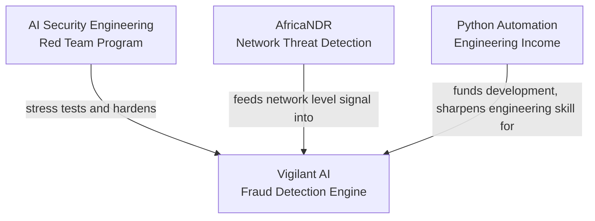

# Charles Kariuki

**AI Security Engineer building fraud and network defense systems for African mobile money**

---

## The Problem I Am Building Against

Kenya lost over 800 billion shillings to mobile money fraud in 2024 alone. The tools that exist to catch fraud were built for Western banks. They understand a stolen credit card. They do not understand a fake M-Pesa reversal message written in Swahili, or a SIM swap attack that hijacks a phone line before a single transaction happens.

I build the systems that close that gap, then spend the rest of my time trying to break those same systems on purpose, so a real attacker never gets the chance.

---

## The Ecosystem

Four connected efforts, each one a real, working system, not a plan for one.

<table>
<tr>
<td width="50%" valign="top">

### 🛡️ Vigilant AI
Fraud detection built for African mobile money. Reads a suspicious message and explains, in plain language, why it does or does not look like fraud.

**98.4%** precision · **100%** recall on test data
Trained on 2,000+ real pattern messages

</td>
<td width="50%" valign="top">

### ⚔️ AI Security Engineering
A twelve month red team program where I learn to attack and defend AI systems, using Vigilant AI as the live target throughout.

**Currently:** Block 1 of 4, AdversarialForge
Proving a model can be fooled by tiny, deliberate changes to a message

</td>
</tr>
<tr>
<td width="50%" valign="top">

### 🌐 AfricaNDR
Network level threat detection for African fintech infrastructure. Watches raw traffic for SIM swap attempts, API abuse, and attacks that happen before a fraud message is ever sent.

**Currently:** log parsing and traffic reading done, anomaly detection model in progress

</td>
<td width="50%" valign="top">

### ⚙️ Python Automation
Freelance engineering work built around three problems businesses actually pay to solve: extracting hard to reach web data, repairing broken code, and connecting systems that should talk to each other.

</td>
</tr>
</table>

---

## Core Domains

| Domain | What It Covers |
|---|---|
| Machine Learning & AI | Model training, evaluation, explainability with SHAP, feature engineering |
| AI Security | Adversarial attacks, model red teaming, secure inference pipelines |
| Network Security | Zeek based traffic analysis, anomaly detection, threat modeling |
| Backend Engineering | FastAPI, REST APIs, webhook systems, database design |

---

## Currently Building

| Project | Focus This Month | Status |
|---|---|---|
| Vigilant AI | AI investigation agents for flagged messages | 🔄 In Progress |
| AI Security Engineering | AdversarialForge, Block 1, tensor foundations and first attacks | 🔄 In Progress |
| AfricaNDR | Flow level feature extraction | 🔄 In Progress |

Weekly progress documented publicly, real builds and real failures included.

---

## GitHub Activity

---

## Open To

Remote AI security or machine learning roles. Small merchants or fintech teams willing to test Vigilant AI and give honest feedback. Anyone working in Zeek scripting or adversarial machine learning who wants to compare notes.

---

